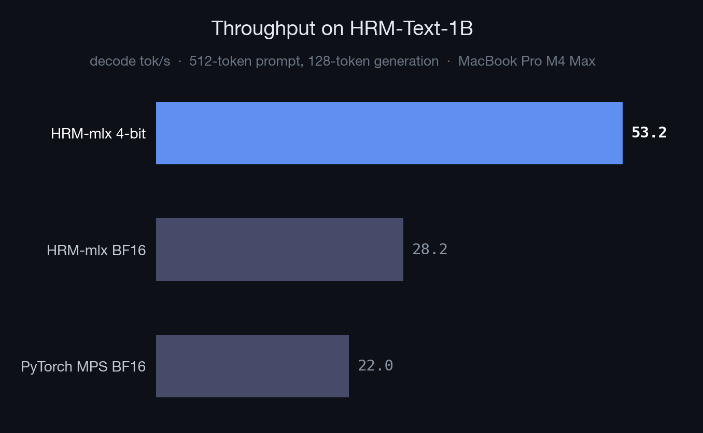

# HRM-mlx

**Apple Silicon inference for HRM-Text-1B.**

[](https://huggingface.co/Aryagm/HRM-Text-1B-MLX-4bit)
[](https://huggingface.co/Aryagm/HRM-Text-1B-MLX-BF16)




https://github.com/user-attachments/assets/4c5f4ff3-599c-409b-bedf-12ac6127a552

Native MLX runtime, hosted 4-bit weights, and small Metal fusions for faster single-response decoding.

HRM-Text-1B on MacBook Pro M4 Max, 32-core GPU:

| Runtime | tok/s | vs MPS |
|---|---:|---:|
| PyTorch MPS BF16 | 22.0 | 1.0x |
| HRM-mlx BF16 | 28.2 | 1.3x |
| **HRM-mlx 4-bit** | **53.2** | **2.4x** |

> Benchmark shape: 512 prompt tokens, 128 generated tokens. Absolute numbers vary by chip; single-stream decode speed is the useful comparison.

## Weights

| Checkpoint | Download | Best for |
|---|---:|---|
| [`Aryagm/HRM-Text-1B-MLX-4bit`](https://huggingface.co/Aryagm/HRM-Text-1B-MLX-4bit) | 740 MB | fastest local decode; default |
| [`Aryagm/HRM-Text-1B-MLX-BF16`](https://huggingface.co/Aryagm/HRM-Text-1B-MLX-BF16) | 2.2 GB | unquantized BF16 baseline |

## Quick start

```bash
git clone https://github.com/Aryagm/HRM-mlx.git && cd HRM-mlx
python3 -m venv .venv
source .venv/bin/activate
pip install -e .
```

Download a hosted MLX checkpoint:

```bash
MODEL_REPO=Aryagm/HRM-Text-1B-MLX-4bit
MODEL_DIR=exports/hrm-text-1b-mlx-mxfp4

# Or use BF16:
# MODEL_REPO=Aryagm/HRM-Text-1B-MLX-BF16
# MODEL_DIR=exports/hrm-text-1b-mlx-bf16

MODEL_REPO="$MODEL_REPO" MODEL_DIR="$MODEL_DIR" python - <<'PY'
import os
from huggingface_hub import snapshot_download

snapshot_download(
    repo_id=os.environ["MODEL_REPO"],
    local_dir=os.environ["MODEL_DIR"],
)
PY
```

Generate:

```bash
hrm-mlx \
  --model-dir "$MODEL_DIR" \
  --prompt '<|im_start|><|quad_end|><|object_ref_end|>What is the derivative of (x^2) / ln(x)? Give the final simplified expression.<|im_end|>' \
  --max-tokens 420 \
  --dtype bfloat16 \
  --metal-swiglu
```

## Python API

```python
from mlx_hrm_text import BF16_MODEL_REPO, HRMTextGenerator

# Default: first run downloads the hosted 4-bit MLX checkpoint.
runner = HRMTextGenerator()
result = runner.generate("What is the derivative of (x^2) / ln(x)?", max_new_tokens=420)
print(result.text)

# Use the hosted BF16 checkpoint instead.
bf16_runner = HRMTextGenerator(repo_id=BF16_MODEL_REPO)

for event in runner.stream("Write a quicksort in Python.", max_new_tokens=128):
    if not event.finished:
        print(event.delta, end="", flush=True)
```

## How it works

[HRM-Text](https://huggingface.co/sapientinc/HRM-Text-1B) is not a normal 1B decoder. Each generated token runs a recurrent reasoning loop:

```text
H_cycles * (L_cycles + 1) = 2 * (3 + 1) = 8 stack passes/token
```

This repo keeps the full recurrence and moves the inference path to MLX: packed HRM weight loading, recurrent KV caches, fast RMSNorm/RoPE/SDPA, persisted MXFP4 weights, and an optional Metal SwiGLU activation.

## What we built

MLX does not ship an HRM-Text runtime. This repo adds the pieces needed to make the model practical on Apple Silicon:

- **Native recurrent decode** with separate H/L stacks and per-recurrence KV caches
- **Packed checkpoint loading** for the published HRM-Text safetensors layout
- **MLX fast paths** for RMSNorm, RoPE, and scaled dot-product attention
- **Persisted MXFP4 weights** so startup does not re-quantize the full model
- **Custom Metal SwiGLU activation** for a small decode win on top of the larger MLX/quantized path
- **Profiling and comparison tools** for HRM-mlx and PyTorch MPS baselines

## Useful commands

```bash
# Recreate the 4-bit checkpoint from original HRM-Text-1B weights
hrm-mlx-quantize --model-dir exports/hrm-text-1b-hf --out-dir exports/hrm-text-1b-mlx-mxfp4 --bits 4 --group-size 32 --mode mxfp4

# Measure decode throughput
hrm-mlx-bench --model-dir exports/hrm-text-1b-mlx-mxfp4 --prompt-tokens 512 --decode-tokens 128 --dtype bfloat16 --metal-swiglu

# Profile decode groups
hrm-mlx-profile --model-dir exports/hrm-text-1b-mlx-mxfp4 --prompt-tokens 512 --decode-tokens 16 --dtype bfloat16 --metal-swiglu

# Compare BF16 vs 4-bit greedy decode drift
python -m benchmarks.compare_quantized_decode --bf16-model-dir exports/hrm-text-1b-hf --q4-model-dir exports/hrm-text-1b-mlx-mxfp4 --metal-swiglu
```

## Notes

HRM-Text-1B is a base reasoning model, not a polished chat assistant. The 4-bit checkpoint matched BF16 on a small qualitative math/reasoning check, but it has not been run through a formal eval suite. Quantization can also change answer length and style because small logit-rank flips early in greedy decoding send the model down a different response path.

## Thanks

This is based on the incredible work by the Sapient team on
[HRM-Text](https://github.com/sapientinc/HRM-Text).

## License

Apache-2.0, matching the upstream HRM-Text release.
