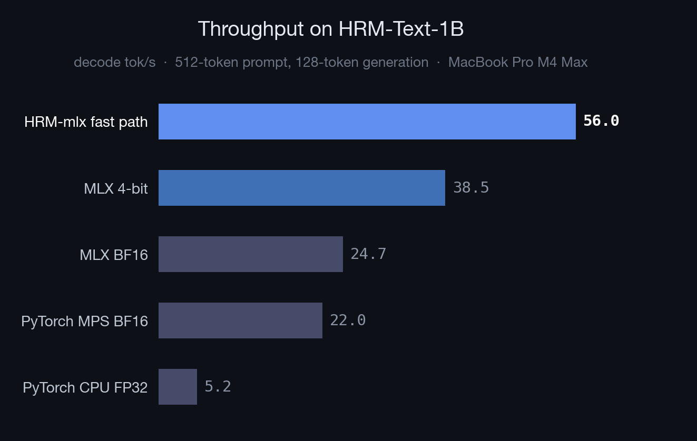
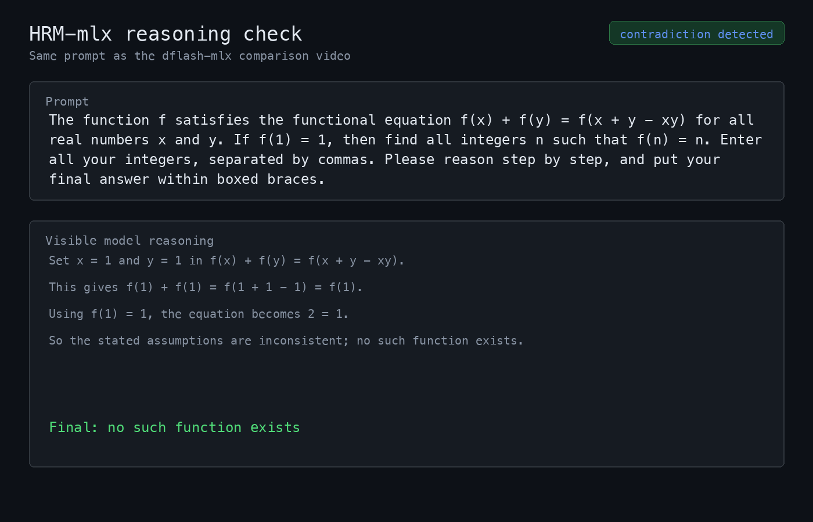

# HRM-mlx

Apple Silicon inference for **HRM-Text-1B**. Native MLX, hosted 4-bit weights, and small Metal fusions for faster single-response decoding.

[](https://huggingface.co/Aryagm/HRM-Text-1B-MLX-4bit)





[Demo comparison video](marketing/assets/demo-comparison.mp4)

HRM-Text-1B on MacBook Pro M4 Max, 32-core GPU:

| Runtime | tok/s | vs CPU |
|---|---:|---:|
| PyTorch CPU FP32 | 5.2 | 1.0x |
| PyTorch MPS BF16 | 22.0 | 4.3x |
| MLX BF16 | 24.7 | 4.8x |
| MLX 4-bit | 38.5 | 7.5x |
| **HRM-mlx fast path** | **56.0** | **10.9x** |

> Benchmark shape: 512 prompt tokens, 128 generated tokens. Absolute numbers vary by chip; single-stream decode speed is the useful comparison.

## Quick start

```bash
git clone https://github.com/Aryagm/HRM-mlx.git && cd HRM-mlx
python3 -m venv .venv
source .venv/bin/activate
pip install -e .
```

Download the hosted 4-bit MLX checkpoint:

```bash
python - <<'PY'
from huggingface_hub import snapshot_download

snapshot_download(
    repo_id="Aryagm/HRM-Text-1B-MLX-4bit",
    local_dir="exports/hrm-text-1b-mlx-mxfp4",
)
PY
```

Generate:

```bash
hrm-mlx \
  --model-dir exports/hrm-text-1b-mlx-mxfp4 \
  --prompt '<|im_start|><|quad_end|><|object_ref_end|>What is the derivative of (x^2) / ln(x)? Give the final simplified expression.<|im_end|>' \
  --max-tokens 420 \
  --dtype bfloat16 \
  --metal-swiglu
```

## Python API

```python
from mlx_hrm_text import HRMTextGenerator

# First run downloads the hosted 4-bit MLX checkpoint.
runner = HRMTextGenerator()
result = runner.generate("What is the derivative of (x^2) / ln(x)?", max_new_tokens=420)
print(result.text)

for event in runner.stream("Write a quicksort in Python.", max_new_tokens=128):
    if not event.finished:
        print(event.delta, end="", flush=True)
```

## How it works

[HRM-Text](https://huggingface.co/sapientinc/HRM-Text-1B) is not a normal 1B decoder. Each generated token runs a recurrent reasoning loop:

```text
H_cycles * (L_cycles + 1) = 2 * (3 + 1) = 8 stack passes/token
```

This repo keeps the full recurrence and moves the inference path to MLX: packed HRM weight loading, recurrent KV caches, fast RMSNorm/RoPE/SDPA, persisted MXFP4 weights, and an optional Metal SwiGLU activation.

## What we built

MLX does not ship an HRM-Text runtime. This repo adds the pieces needed to make the model practical on Apple Silicon:

- **Native recurrent decode** with separate H/L stacks and per-recurrence KV caches
- **Packed checkpoint loading** for the published HRM-Text safetensors layout
- **MLX fast paths** for RMSNorm, RoPE, and scaled dot-product attention
- **Persisted MXFP4 weights** so startup does not re-quantize the full model
- **Custom Metal SwiGLU activation** for a small decode win on top of the larger MLX/quantized path
- **Profiling and comparison tools** for MLX, PyTorch MPS, and CPU baselines

## Useful commands

```bash
# Recreate the 4-bit checkpoint from original HRM-Text-1B weights
hrm-mlx-quantize --model-dir exports/hrm-text-1b-hf --out-dir exports/hrm-text-1b-mlx-mxfp4 --bits 4 --group-size 32 --mode mxfp4

# Measure decode throughput
hrm-mlx-bench --model-dir exports/hrm-text-1b-mlx-mxfp4 --prompt-tokens 512 --decode-tokens 128 --dtype bfloat16 --metal-swiglu

# Profile decode groups
hrm-mlx-profile --model-dir exports/hrm-text-1b-mlx-mxfp4 --prompt-tokens 512 --decode-tokens 16 --dtype bfloat16 --metal-swiglu

# Compare BF16 vs 4-bit greedy decode drift
python -m benchmarks.compare_quantized_decode --bf16-model-dir exports/hrm-text-1b-hf --q4-model-dir exports/hrm-text-1b-mlx-mxfp4 --metal-swiglu
```

## Notes

HRM-Text-1B is a base reasoning model, not a polished chat assistant. The 4-bit checkpoint matched BF16 on a small qualitative math/reasoning check, but it has not been run through a formal eval suite. Quantization can also change answer length and style because small logit-rank flips early in greedy decoding send the model down a different response path.

Marketing assets are reproducible: the chart comes from `benchmarks/metrics_history.csv`, and the demo video is rendered from verified transcripts in `marketing/assets/captures`.

## License

Apache-2.0, matching the upstream HRM-Text release.
